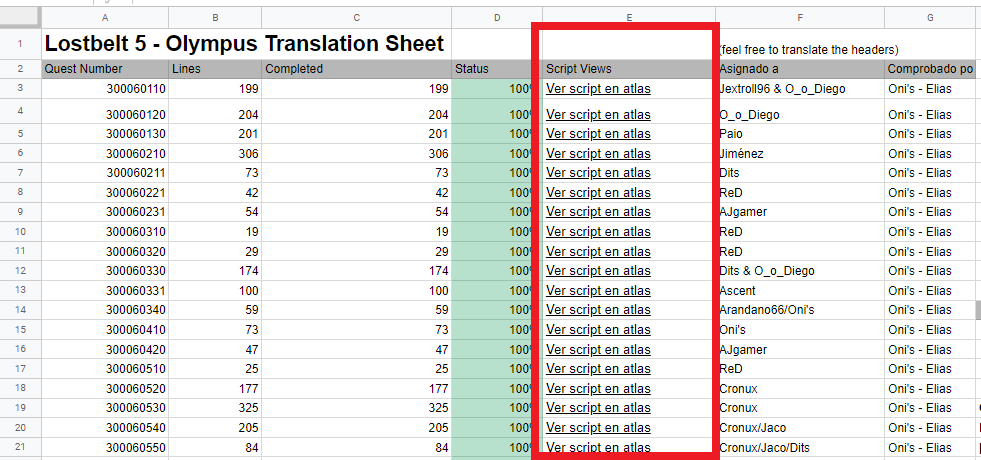
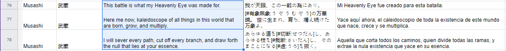
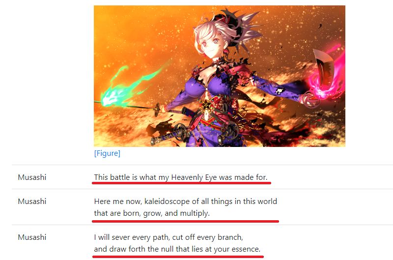
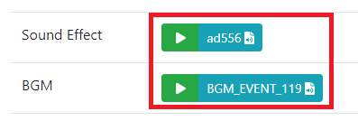
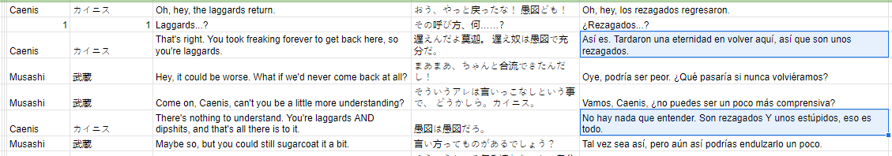
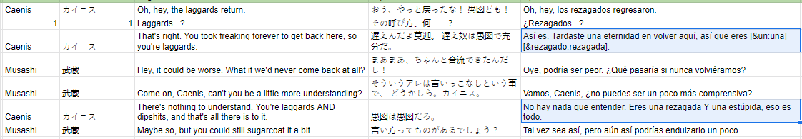
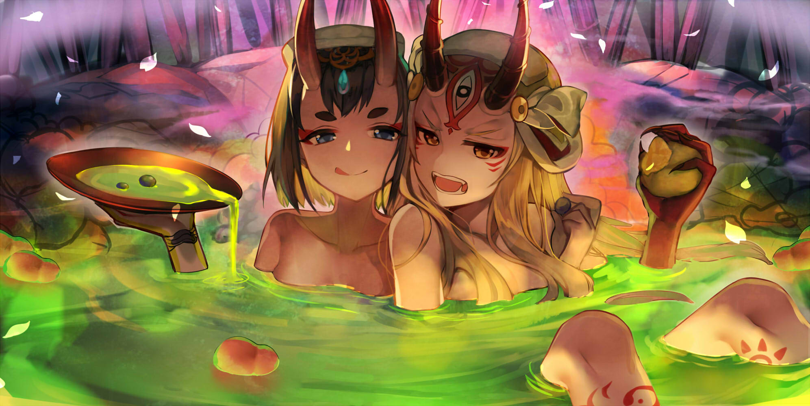

# Contextualización


**Pauta** importante, prestar atención a lo descrito en esta página.


Es la base de toda **Traducción**, no vale la pena traducir algo si no tiene sentido al leerse, y sobre todo, si no se conecta con las celdas previamente traducidas.

Por esa razón, es **obligatorio** que todo **Traductor** y **Corrector** use la página de <mark style="color:blue;">**Atlas**</mark> para traducir, si para el momento de que los **Correctores** corrijan las celdas de los **Traductores**, estas carecen de sentido alguno, tomaremos por hecho que no están usando la página de <mark style="color:blue;">**Atlas**</mark> y se les hará un llamado de atención.

* El **índice** del <mark style="color:blue;">**Proyecto**</mark> a traducir contará con el enlace de <mark style="color:blue;">**Atlas**</mark> de la celda que traducirán, solo deben clickear en el enlace y los llevara a la página.

* La página de <mark style="color:blue;">**Atlas**</mark> es sencilla, ella proporciona el escenario en cuestión que se traducirá.

**Página de Atlas** <mark style="color:red;">**--->**</mark> [<mark style="color:blue;">**0300062330**</mark>](https://apps.atlasacademy.io/db/NA/script/0300062330) <mark style="color:red;">**<---**</mark> Clickear

* Incluso cuenta con las expresiones de los personajes:

**Soundtrack** del escenario, **sonidos** sencillos como pasos de caminata, **choques de espada**, **golpes**, etc, para que el traductor se contextualice sobre el escenario.

Solo es cuestión de presionar el botón de **Play** para reproducir el sonido.


El uso de <mark style="color:blue;">**Atlas**</mark> para **Traducir** y **Corregir** es obligatorio.

El, "_<mark style="color:blue;">Yo puedo contextualizarme rápido sin usarlo</mark>_" no será excusa alguna y en caso de encontrar falta de contextualización en sus celdas recibirán un llamado de atención.


## Dirección de los Diálogos

Como bien saben, este juego es una experiencia en primera persona, toda lectura será con la intención de que el jugador se autoinserte en la historia y viva tal experiencia.

Pero, que sea de esa manera, no quiere decir que cada diálogo existente en esta historia va dirijo al <mark style="color:blue;">**Protagonista**</mark>.

Muchos **Traductores** traducen erróneamente la dirección de los diálogos, que originalmente va dirigido hacia un grupo de personas, con diálogos hacia el <mark style="color:blue;">**Protagonista**</mark>, cuando no siempre es así.

Deben prestar atención a tales escenarios.

**Ejemplo:**


En este diálogo, desde un inicio de la conversación, **Caenis** se refiere a un GRUPO de personas que involucran otros aparte del <mark style="color:blue;">**Protagonista**</mark>.


Si bien las expresiones "<mark style="color:blue;">**You**</mark>" o "<mark style="color:blue;">**You're**</mark>" pueden referirse a un individuo, dependiendo del contexto, se utiliza para un grupo de personas.

* En este caso, la palabra "**laggards**" ya deja en claro que se refiere a un grupo de personas.

Deben leer y comprender el escenario, para eso no solo están los diálogos, también está la página de <mark style="color:blue;">**Atlas**</mark>.


_La siguiente es una forma errónea de traducir el mismo escenario:_



En caso dudas, preguntar en el <mark style="color:blue;">**Chat del Proyecto**</mark>.


.png>)

