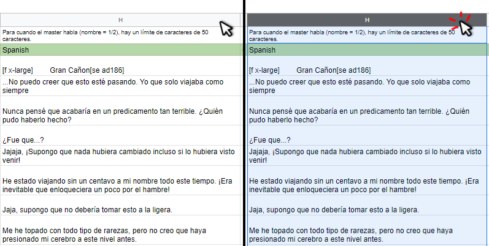
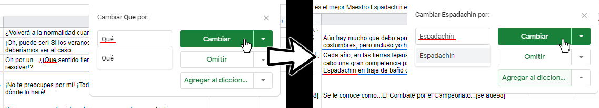
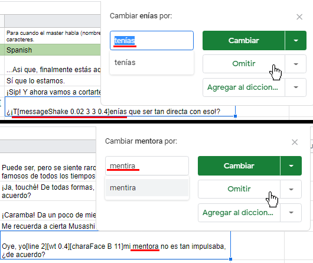
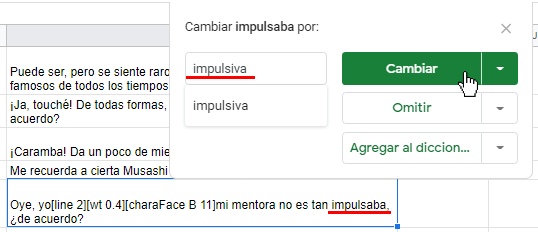
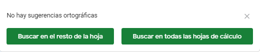

# Escritura, Redacción, Ortografía y Acentuación

En la actualidad, a pesar de que han pasado por una educación gramatical, muchos no aplican eso todo el tiempo, dando paso a errores de ortografía, acentuación, así como el uso incorrecto de signos de exclamación e interrogación.


No se tolerará la falta de esto, independiente del caso de ser o no buenos escritores, les pedimos que usen la herramienta de corrección que se encuentra disponible en las hojas.


La forma de usarla, es sencilla:

* Seleccionarán las casillas traducidas con el ratón, todas, solo basta presionar la **letra** de la columna **Español**:

* Irán al botón de **Herramientas** en el apartado superior de las hojas, seleccionarán la opción de <mark style="color:blue;">Ortografía y gramática</mark>, y luego <mark style="color:blue;">Corrector ortográfico</mark>:

.png>)

* Una vez hecho eso, la herramienta se encargará de enseñarles los errores de ortografía que se encuentra en la columna a través de un **recuadro** en la parte superior derecha.
* En caso de haber una palabra a ser corregida, presionarán en "**Cambiar**".
* Una vez presionado "**Cambiar**" corregirá la palabra, y automáticamente buscará la siguiente con errores:

* Por supuesto la herramienta no es perfecta, en ocasiones resaltará palabras que no necesitaran de una corrección, como alguna **Pauta** que los **Líderes** hayan establecido o palabras combinadas con **Variables**.
* También puede resaltar palabras que posean una adecuada contextualización, deben leer detenidamente y determinar cuando "**Omitirán**" dichas palabras.
* Una vez estén seguros de que dicha palabra no necesite corrección, presionaran "**Omitir**" y la herramienta pasara a la siguiente palabra:

* La herramienta también se encargará de enseñarles palabras que puedan arreglar el contexto de ciertos escenarios:

* Utilizarán la herramienta para **corregir** u **omitir** hasta que les salga el mensaje de "<mark style="color:blue;">**No hay sugerencias ortográficas**</mark>".

## Blasfemias, Groserías y Referencias Sexuales

La **Traducción NA** suele tener una gran cantidad de libertades con respecto a esto, cuando originalmente no es así, más adelante hablaremos de esto.

Cuidado con el uso excesivo y repetitivo de palabras explícitas, en especial **Jergas** insultantes, se trabaja con palabras **Neutras**, y esto si se da únicamente en el caso de los insultos durante la contextualización, en caso contrario, se prohíbe el añadido de insultos o groserías a las conversaciones que no las poseen.

**Aceptables:**

* Maldición
* Demonios
* Maldita sea
* Diablos
* Vete al Infierno
* Infeliz
* Imbécil
* Bastardo
* Maldito

**No permitidos:**

* Furro/a
* Coño
* Verga
* Mierda
* Culo
* Gilipollas


El uso de estas palabras, o cualquier insulto no mencionado en la lista, así como cualquier **referencia** **sexual**, debe ser obligatoriamente consultada en el <mark style="color:blue;">**Chat del Proyecto**</mark>.



En caso de pasar esto por alto y traten esto **deliberadamente** o **intencional**, recibirán un llamado de atención.


