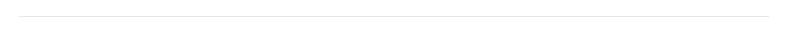

# Jergas

Aunque en la mayoría somos un grupo hispano, nuestro parche también es utilizado personas de España, personas que no entenderán términos de grupos sociales de una nación fuera de la suya.

Está **terminantemente prohibido** utilizar **Jergas** de cualquier índole, sin importar la situación del escenario, en tal caso se **consultara obligatoriamente** con el Líder **de Traducciones** a cargo de dicho proyecto para confirmar si se utilizara o no la expresión.


El ignorar esto, y al momento de la corrección se encuentra alguna, se le hará un llamado de atención al **Traductor**.


## Jergas Americanas

Así como los hispanos tienen sus jergas, los Americanos también las tienen, y muchas de estas aparecen en las Traducciones de **NA**.

Pero que quede claro que todas y cada una de estas expresiones suelen carecer de sentido alguno al ser **Traducidas** al **Español**, desde la más mínima expresión, hasta el dicho más largo que puedan decir, en casos similares se debe consultar con el **Líder de Traducciones** a cargo del <mark style="color:blue;">**Proyecto**</mark>.

Las siguientes son palabras que no tiene una traducción al español tan literal, además pueden ser ignoradas por el **Traductor** si así lo desea.

* _<mark style="color:blue;">**Well**</mark>, <mark style="color:blue;">**well**</mark>_ **/** _<mark style="color:blue;">**Oh my**</mark>, <mark style="color:blue;">**oh my**</mark>_

Es una expresión de admiración por una situación, o acto de algún personaje, su traducción seria:


_<mark style="color:blue;">Vaya</mark>_ o _<mark style="color:blue;">Cielos</mark>_.


Incluso posee otras expresiones utilizables. Pero la siguiente es una traducción errónea:


_<mark style="color:blue;">Bueno, bueno</mark> / <mark style="color:blue;">Oh mi, oh mi</mark>_


**Ejemplo:**

* _<mark style="color:blue;">**Well**</mark>, <mark style="color:blue;">**well**</mark>, who knew you could do something like that._


_<mark style="color:blue;">**Bueno**</mark>, <mark style="color:blue;">**bueno**</mark>, quien diría que podrías hacer algo como eso._



_<mark style="color:blue;">**Vaya**</mark>, quien diría que podrías hacer algo como eso._


.png>)

* _<mark style="color:blue;">**Oh my**</mark>, <mark style="color:blue;">**oh my**</mark>, what an exciting situation!_


_¡<mark style="color:blue;">**Oh mi**</mark>, <mark style="color:blue;">**oh mi**</mark>, pero que situación tan emocionante!_



_¡<mark style="color:blue;">**Cielos**</mark>, pero que situación tan emocionante!_


**Atención**

Únicamente personajes como **Minamoto no Raikou** y **Sesshouin Kiara**, tienen permitido usar la siguiente Traducción a esta expresión:


_<mark style="color:blue;">**Ara, ara**</mark>._


.png>)

* _<mark style="color:blue;">**Man**</mark> / <mark style="color:blue;">**Oh man**</mark>_

Es la expresión más utilizada en la jerga americana, la utilizan incluso con personajes femeninos, y es la que en su totalidad nunca debe traducirse como: <mark style="color:blue;">**Hombre**</mark> / <mark style="color:blue;">**Oh hombre**</mark>.

Es una expresión que puede ser usada en admiración a una situación, así como preocupación.&#x20;

Al igual que la anterior, pueden ignorarla o incluso se puede usar diferentes expresiones como:&#x20;


<mark style="color:blue;">Vaya</mark>, <mark style="color:blue;">cielos</mark>, <mark style="color:blue;">demonios</mark>, <mark style="color:blue;">maldición</mark>, <mark style="color:blue;">increíble</mark>, <mark style="color:blue;">impresionante</mark>, etc<mark style="color:blue;">.</mark>


Todo esto dependiendo del contexto en el escenario.

**Ejemplo:**

* _<mark style="color:blue;">**Man**</mark>, seriously, do we have to fight that thing one more time?_


_<mark style="color:blue;">**Hombre**</mark>, en serio, ¿tenemos que luchar contra esa cosa una vez más?_



_<mark style="color:blue;">**Cielos**</mark>, en serio, ¿tenemos que luchar contra esa cosa una vez más?_


.png>)

* _<mark style="color:blue;">**Man**</mark>, he just released an incredible amount of magic energy!_


_¡<mark style="color:blue;">**Hombre**</mark>, acaba de lanzar una cantidad increíble de energía mágica!_



_¡<mark style="color:blue;">**Maldición**</mark>, acaba de lanzar una cantidad increíble de energía mágica!_


.png>)

* <mark style="color:blue;">**Okay**</mark>, <mark style="color:blue;">**Okie Dokie**</mark>, <mark style="color:blue;">**Yeah**</mark>, o similares.

Son expresiones de afirmación, está permitido utilizar "**Okay**" como respuesta a algo, pero no spamearla en múltiples líneas y sobre todo ignorando el escenario en cuestión.


Sean consientes de que se puede volver repetitivo si solo responden con "**Okay**".


Para esta jerga existe varias traducciones que pueden escoger:


_<mark style="color:blue;">Bien</mark>, <mark style="color:blue;">Está bien</mark>, <mark style="color:blue;">Muy bien</mark>, <mark style="color:blue;">De acuerdo</mark>, <mark style="color:blue;">Entiendo</mark>, <mark style="color:blue;">Perfecto</mark>, <mark style="color:blue;">Comprendo</mark>, <mark style="color:blue;">Me parece bien</mark>._


Y "**Yeah**" no se traduce como: **Seh** o **See**, significa simplemente: <mark style="color:blue;">**Sí**</mark> o <mark style="color:blue;">**Así es**</mark>.

Algunas de estas expresiones de afirmación pueden incluir a un **grupo de personas**, así que deben tenerlo en cuenta al utilizarlas.


_<mark style="color:blue;">Comprendemos</mark>, <mark style="color:blue;">Estamos de acuerdo</mark>, <mark style="color:blue;">Nos parece bien</mark>, <mark style="color:blue;">Entendemos</mark>._


.png>)

* <mark style="color:blue;">**Hey**</mark> / <mark style="color:blue;">**Hey there**</mark>

Es una expresión utilizada para llamar la atención de alguien, está permitido utilizar el "**Hey**", pero dependiendo del contexto se utilizan otras traducciones:


&#x20;_<mark style="color:blue;">Hola</mark>, <mark style="color:blue;">oye</mark>, <mark style="color:blue;">oigan</mark>, etc._


**Ejemplo:**

* _<mark style="color:blue;">**Hey there**</mark>, Mash, how have you been?_


_<mark style="color:blue;">**Hey ahí**</mark>, Mash, ¿cómo has estado?_



_<mark style="color:blue;">**Hola**</mark>, Mash, ¿cómo has estado?_


.png>)

* _<mark style="color:blue;">**Hey**</mark>, it's not what you think!_


_¡<mark style="color:blue;">**Oye**</mark>, no es lo que piensas!_

_¡<mark style="color:blue;">**Hey**</mark>, no es lo que piensas!_


.png>)

* <mark style="color:blue;">**There**</mark>

Deben tener cuidado con el "**There**" en las conversaciones, son expresiones para señalar y a veces usadas para hablar sobre un personaje que se encuentra **presente** durante la conversación, su traducción en este último es errónea, puede incluso ser ignorado durante la traducción.

**Ejemplo:**

* <mark style="color:blue;">**Goredolf**</mark> sobre <mark style="color:blue;">**Musashi**</mark>, mientras ella está presente:

_So, Musashi <mark style="color:blue;">**there**</mark>, was wandering for a long time between different worlds._


_Entonces, Musashi <mark style="color:blue;">**ahí**</mark>, estuvo vagando por mucho tiempo entre diferentes mundos._



_Entonces, Musashi, estuvo vagando por mucho tiempo entre diferentes mundos._


.png>)

* <mark style="color:blue;">**Anne & Mary**</mark> sobre <mark style="color:blue;">**Teach**</mark>, mientras él está presente:

_We were fighting that thing, when we finally managed to corner him, Blackbeard <mark style="color:blue;">**there**</mark>, he really was completely useless and let him get away._


_Estábamos peleando contra esa cosa, cuando finalmente logramos acorralarlo, Barba Negra <mark style="color:blue;">**ahí**</mark>, realmente fue un completo inútil al dejarlo escapar._



_Estábamos peleando contra esa cosa, cuando finalmente logramos acorralarlo, Barba Negra realmente fue un completo inútil al dejarlo escapar._


.png>)

Por supuesto, hay casos donde realmente señalan a alguien tomando en cuenta el escenario.

* _All right, then, you <mark style="color:blue;">**there**</mark>, you'll come with me._


_Muy bien, entonces, tú el de <mark style="color:blue;">**ahí**</mark>, vendrás conmigo._


* _It's not like it matters, that Servant <mark style="color:blue;">**there**</mark> isn't that strong._


_No es como si importara, ese Servant de <mark style="color:blue;">**allí**</mark> no es tan fuerte._


.png>)

* <mark style="color:blue;">**Huh**</mark>

La jerga más repetida en el idioma inglés, se traduce como: **Eh**.


<mark style="color:blue;">**¿Huh?**</mark>, <mark style="color:blue;">**¿¡Huh!?**</mark>, <mark style="color:blue;">**¡Huh!**</mark>



<mark style="color:blue;">**¿Eh?**</mark>, <mark style="color:blue;">**¿¡Eh!?**</mark>, <mark style="color:blue;">**¡Eh!**</mark>



Toda expresión **Americana** encontrada durante las correcciones y que carezcan de sentido para el contexto del escenario, se le hará un llamado de atención al **Traductor**.



Todos los <mark style="color:blue;">**errores**</mark> usados como **ejemplos** en esta sección, son errores encontrados durante las correcciones de los **Líderes de Traducción**.


.png>)

.jpg>)
