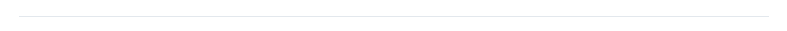

# Signos de Puntuación, Exclamación e Interrogación.

Se les pide que lean atentamente esta sección, muchos **Traductores** no manejan correctamente estos signos.


Nota para **Correctores**:

Cualquier falta a esta <mark style="color:blue;">**Sección**</mark> debe ser reportada a los **Líderes de Traducción** para tratar con los **Traductores**.


## Coma (,)

La **coma** es una breve pausa en el enunciado, es el signo de puntuación que más se encontraran en los diálogos, si bien es cierto que es de los más sencillos, se suele cometer errores con ella al ser empleadas con otros signos o variables.

Cuando en un enunciado hay una **Variable** junto a a una coma, ya sea antes o después de la variable, debe ser respetada, nunca deben separar o pegar la **Variable** a no ser que ese sea el caso.

**Ejemplo:**

* _But,<mark style="color:blue;">\[wt 0.7]\[charaFace C 1]</mark> there is no way it can be like that!_


_Pero,<mark style="color:blue;">\[wt 0.7]\[charaFace C 1]</mark>¡no hay manera de que sea así!_



_Pero,<mark style="color:blue;">\[wt 0.7]\[charaFace C 1]</mark> ¡no hay manera de que sea así!_


El diálogo inglés mantiene la coma **(,)** pegada a una **Variable**, al finalizar la variable hay un espacio, en caso de hacer la <mark style="color:red;">traducción errónea</mark>, en el Parche se verá de esta manera:


_Pero<mark style="color:blue;">,</mark>¡no hay manera de que sea así!_


Lo cual, es un error de **redacción**, que si bien se puede perdonar, el hecho de que pueda causar un bug en el parche por la **alteración** de la **Variable** en el diálogo no es improbable.

Otro error común es el de utilizar la coma **(,)** en combinación con **Variables** sin estar presentes en los diálogos originales a traducir:

* _<mark style="color:blue;">\[51ffff]</mark>Of course!<mark style="color:blue;">\[-]</mark>_ _<mark style="color:blue;">\[51ffff]</mark>It's the latest Storm Border defense system!<mark style="color:blue;">\[-]</mark>_


_<mark style="color:blue;">\[51ffff]</mark>¡Por supuesto!<mark style="color:blue;">\[-]</mark>**,**_ _<mark style="color:blue;">\[51ffff]</mark>¡Es el sistema de defensa más reciente del Storm Border!<mark style="color:blue;">\[-]</mark>_


.png>)

* _Anyway, if he's omnipotent<mark style="color:blue;">\[line 2]</mark>and it appears he is<mark style="color:blue;">\[line 2]</mark>then he's the most powerful being on all of Olympus._


_Como sea, si él es omnipotente**,**<mark style="color:blue;">\[line 2]</mark>**,**y parece que lo es**,**<mark style="color:blue;">\[line 2]</mark>**,**entonces es el ser más poderoso en todo el Olimpo._


.png>)

* _<mark style="color:blue;">\[f large]</mark> You can call me, Miyamoto Musashi!_


_<mark style="color:blue;">\[f large]</mark>**,** ¡Puedes llamarme, Miyamoto Musashi!_


## Punto (.)

En los diálogos existe el "<mark style="color:blue;">**Punto y seguido**</mark>", así como el "<mark style="color:blue;">**Punto y aparte**</mark>", no existe mucha complicación con este, y aplica la misma **Pauta** que las comas, no se debe usar en combinación con **Variables**, a menos que así sea en el diálogo correspondiente, respetando el espacio existente o no en dicho diálogo.

**Ejemplo:**

* _Okay, thanks, guys.<mark style="color:blue;">\[wt 0.4]\[charaFace K 1]</mark> Now let me take it from here, or we'll be here all day!_


_De acuerdo, gracias, chicos.<mark style="color:blue;">\[wt 0.4]\[charaFace K 1]</mark> ¡Me encargaré apartir de ahora, de lo contrario tomará todo el día!_


Y por supuesto, lo más importante, terminar siempre las frases con un **Punto (.)** en cada diálogo que se presente su caso, después de todo, es parte de la buena gramática.

## Los Tres Puntos Suspensivos (...)

Este signo es el que presenta un mayor reto para los **Traductores**, representa una pausa, o suspenso en la conversación/diálogo en el que se aplica.

El primer problema a tratar, es su uso en combinación con **Variables** y el mal trato con los <mark style="color:blue;">**espacios existentes**</mark> en los diálogos de las hojas, así como el uso de <mark style="color:blue;">**Mayúsculas**</mark> y <mark style="color:blue;">**Minúsculas**</mark>.

Con este signo hay varios aspectos a remarcar:

* No se permite separar los diálogos de los **(...)** si en el diálogo original está pegado a la palabra siguiente, pero sobre todo, no se puede iniciar en <mark style="color:blue;">**Mayúscula**</mark>.

La razón de esto, es que en esta clase de diálogo tan solo es una pausa para continuar con la conversación o frase.

**Ejemplo:**

* _Demeter is<mark style="color:blue;">**...**</mark>changing direction!?_


_¿¡Deméter está<mark style="color:blue;">**...**</mark>_ _**C**ambiando de dirección!?_



_¿¡Deméter está<mark style="color:blue;">**...**</mark>cambiando de dirección!?_


.png>)

* _Gah! You<mark style="color:blue;">**...**</mark>stabbed me in the<mark style="color:blue;">**...**</mark>back?_


_¡Gah! M-me<mark style="color:blue;">**...**</mark>_ _**A**cabas de<mark style="color:blue;">**...**</mark> ¿**A**puñalar?_



_¡Gah! M-me<mark style="color:blue;">**...**</mark>acabas de<mark style="color:blue;">**...**</mark>¿apuñalar?_


.png>)

* No se permite pegar los diálogos a los **(...)** si en el diálogo original está separado a la palabra siguiente, pero sobre todo, no se puede iniciar en <mark style="color:blue;">**Minúscula**</mark>.

En esta clase de diálogos, representa una pausa en el **fin** de un diálogo o frase, para comenzar una **nueva** o diferente, absolutamente **NO ES** la continuación del diálogo o frase **previa**.

**Ejemplo:**

* _Being alive<mark style="color:blue;">**...**</mark> Being dead<mark style="color:blue;">**...**</mark> It's all the same._


Estar vivo<mark style="color:blue;">**...**</mark>**e**star muerto<mark style="color:blue;">**...**</mark>**e**s lo mismo.



_Estar vivo<mark style="color:blue;">**...**</mark> Estar muerto<mark style="color:blue;">**...**</mark> Es lo mismo._


.png>)

* _Well<mark style="color:blue;">**...**</mark> There's the fact that I saved your life<mark style="color:blue;">**...**</mark>_


_Bueno<mark style="color:blue;">**...**</mark>**e**stá el hecho de que te salvé la vida<mark style="color:blue;">**...**</mark>_



_Bueno<mark style="color:blue;">**...**</mark> Está el hecho de que te salvé la vida<mark style="color:blue;">**...**</mark>_


.png>)

* Se debe cuidar el uso de <mark style="color:blue;">**Mayúscula**</mark> o <mark style="color:blue;">**Minúscula**</mark> con los **(...)** cuando se pasa a la siguiente línea.

Como bien saben, son varias líneas que trabajan, los diálogos se dividen y comparten entre diferentes líneas, los **(...)** también se utilizan para continuar un diálogo en la siguiente línea o iniciar uno nuevo, por ende, en ocasiones iniciara en <mark style="color:blue;">**Mayúscula**</mark> o <mark style="color:blue;">**Minúscula**</mark>.

**Ejemplo:**

* _<mark style="color:blue;">**Deméter**</mark>**:**_

_Even as I gaze up at the sky<mark style="color:blue;">**...**</mark>_

_<mark style="color:blue;">**...**</mark>I know nothing I see there will ever excite me again._


_Incluso mientras miro hacia el cielo<mark style="color:blue;">**...**</mark>_

_<mark style="color:blue;">**...**</mark>_ _**S**é que nada de lo que vea allí me volverá a emocionar._



_Incluso mientras miro hacia el cielo<mark style="color:blue;">**...**</mark>_

_<mark style="color:blue;">**...**</mark>sé que nada de lo que vea allí me volverá a emocionar._


Tal como ven, la frase de <mark style="color:blue;">**Deméter**</mark> corresponde a una sola, se puede identificar por el hecho de que la <mark style="color:blue;">segunda</mark> línea continua y mantiene el contexto de la <mark style="color:blue;">primera</mark>.&#x20;

Por esa razón, la <mark style="color:blue;">segunda</mark> línea inicia en <mark style="color:blue;">**Minúscula**</mark> y se mantiene pegado a los **(...)**.

.png>)

* <mark style="color:blue;">**Musashi**</mark>**:**

_It's a whole different story when you're up against a solid mass of machinery<mark style="color:blue;">**...**</mark>_

_<mark style="color:blue;">**...**</mark>It just goes to show there's some things I can't cut even from the void._


_Es una historia completamente diferente cuando te enfrentas a una maquinaria de masa sólida<mark style="color:blue;">...</mark>_&#x20;

_<mark style="color:blue;">...</mark>_ _**e**sto solo demuestra que hay algunas cosas que ni siquiera yo puedo cortar aún después de alcanzar el vacío._



_Es una historia completamente diferente cuando te enfrentas a una maquinaria de masa sólida<mark style="color:blue;">**...**</mark>_

_<mark style="color:blue;">**...**</mark>Esto solo demuestra que hay algunas cosas que ni siquiera yo puedo cortar aún después de alcanzar el vacío._


En esta ocasión, <mark style="color:blue;">**Musashi**</mark> hace una pausa para iniciar una nueva frase en la <mark style="color:blue;">segunda</mark> línea, absolutamente **no es** la continuación de la <mark style="color:blue;">primera</mark> línea.

Por ende, la segunda línea inicia en <mark style="color:blue;">**Mayúscula**</mark> y pegado a los **(...)**.


Cabe resaltar que siempre que una línea nueva empiece con los **(...)**, la frase siempre debe estar pegada a estos, independiente de si inicie en <mark style="color:blue;">**Mayúscula**</mark> o <mark style="color:blue;">**Minúscula**</mark>.


## Signos de Exclamación e Interrogación.

Uno es un signo que representa sorpresa, asombro, alegría, alteraciones... Mientras que el otro representa una pregunta o cuestionamiento.

Las frases o diálogos que contengan estos signos deben, obligatoriamente, iniciar y terminar con ellos respectivamente:

* <mark style="color:blue;">**¡!**</mark>
* <mark style="color:blue;">**¿?**</mark>

**Exclamación:**


_No lo puedo creer<mark style="color:blue;">**!**</mark>_



_<mark style="color:blue;">**¡**</mark>No lo puedo creer<mark style="color:blue;">**!**</mark>_


**Interrogación:**


_Estás bien, Da Vinci<mark style="color:blue;">**?**</mark>_



_<mark style="color:blue;">**¿**</mark>Estás bien, Da Vinci<mark style="color:blue;">**?**</mark>_


.png>)

Como **Traductores** deberán identificar cuando un diálogo inicia y termina una <mark style="color:blue;">**Exclamación**</mark>/<mark style="color:blue;">**Interrogación**</mark>.

Cuando se traduce, no todo el diálogo **Inglés** que termina con un signo de "<mark style="color:blue;">**!**</mark>" o "<mark style="color:blue;">**?**</mark>" es una <mark style="color:blue;">**Exclamación**</mark>/<mark style="color:blue;">**Interrogación**</mark>, equivocarse en esto puede causar perdidas en el contexto de los escenarios, además de arruinar la lectura de los mismos.

**Ejemplo:**

* _Are you okay, Senpai<mark style="color:blue;">**?**</mark>_


_Estás bien, <mark style="color:blue;">**¿**</mark>Senpai<mark style="color:blue;">**?**</mark>_



_<mark style="color:blue;">¿</mark>Estás bien, Senpai<mark style="color:blue;">**?**</mark>_


.png>)

* _No, that's not it. She used some sort of spell to appear here instantly<mark style="color:blue;">**!**</mark>_


_<mark style="color:blue;">**¡**</mark>No, no es eso. Usó algún tipo de hechizo para aparecer aquí instantáneamente<mark style="color:blue;">**!**</mark>_



_No, no es eso. <mark style="color:blue;">**¡**</mark>Usó algún tipo de hechizo para aparecer aquí instantáneamente<mark style="color:blue;">**!**</mark>_


.png>)

* _Then again, maybe it hasn't been that long after all<mark style="color:blue;">**?**</mark>_


_<mark style="color:blue;">**¿**</mark>Entonces, tal vez no ha pasado tanto tiempo después de todo<mark style="color:blue;">**?**</mark>_



_Entonces, <mark style="color:blue;">**¿**</mark>tal vez no ha pasado tanto tiempo después de todo<mark style="color:blue;">?</mark>_


.png>)

* _Oh, that<mark style="color:blue;">**?**</mark>_


_<mark style="color:blue;">**¿**</mark>Oh, eso<mark style="color:blue;">**?**</mark>_



_Oh, <mark style="color:blue;">**¿**</mark>eso<mark style="color:blue;">**?**</mark>_


.png>)

* _Ah, so you noticed that, did you<mark style="color:blue;">**?**</mark>_


_Ah, <mark style="color:blue;">**¿**</mark>así que te diste cuenta de eso, verdad<mark style="color:blue;">**?**</mark>_



_Ah, así que te diste cuenta de eso, <mark style="color:blue;">**¿**</mark>verdad<mark style="color:blue;">**?**</mark>_


.png>)

Como pueden ver, en ocasiones la **pregunta** se encuentra al **final** del enunciado, no toda la oración es una pregunta.

.png>)

### Uso de ambos signos en una oración.

Se pueden encontrar frases o diálogos con el uso de ambos signos, así mismo también deben distinguir cuando inicia la <mark style="color:blue;">**Exclamación**</mark> y la <mark style="color:blue;">**Interrogación**</mark> en estos casos.

Solo porque una frase en **inglés** termine en "<mark style="color:blue;">**!?**</mark>" quiere decir que toda la frase la encerraran con dichos signos.

**Ejemplos:**

* You touched my spear, didn't you<mark style="color:blue;">**!?**</mark>


_<mark style="color:blue;">**¿¡**</mark>Tocaste mi lanza, no es así<mark style="color:blue;">**!?**</mark>_



_<mark style="color:blue;">**¡**</mark>Tocaste mi lanza, <mark style="color:blue;">**¿**</mark>no es así<mark style="color:blue;">**?!**</mark>_


.png>)

* _Are you alright, Mash<mark style="color:blue;">**!?**</mark>_


_<mark style="color:blue;">**¡**</mark>Te encuentras bien, <mark style="color:blue;">**¿**</mark>Mash<mark style="color:blue;">**?!**</mark>_



_<mark style="color:blue;">**¿¡**</mark>Te encuentras bien, Mash<mark style="color:blue;">**!?**</mark>_


.png>)

### Uso de Mayúsculas con los signos de Exclamación e Interrogación.

Al **finalizar** con uno de estos signos, y se vuelve a **abrir** con dichos signos la siguiente frase, siempre inicia con <mark style="color:blue;">**Mayúscula**</mark>, nunca en <mark style="color:blue;">**Minúscula**</mark>.

**Ejemplos:**

* _You<mark style="color:blue;">**?**</mark> Really<mark style="color:blue;">**?**</mark> There's no way that's true<mark style="color:blue;">**!**</mark>_


<mark style="color:blue;">**¿**</mark>_Tu<mark style="color:blue;">**?**</mark>_ _<mark style="color:blue;">**¿**</mark>en serio<mark style="color:blue;">**?**</mark>_ _<mark style="color:blue;">**¡**</mark>no hay manera de que eso sea verdad<mark style="color:blue;">**!**</mark>_



_<mark style="color:blue;">**¿**</mark>Tu<mark style="color:blue;">**?**</mark>_ _<mark style="color:blue;">**¿**</mark>En serio<mark style="color:blue;">**?**</mark>_ _<mark style="color:blue;">**¡**</mark>No hay manera de que eso sea verdad<mark style="color:blue;">**!**</mark>_


.png>)

* _Amazing<mark style="color:blue;">**!**</mark> You really did it, Senpai<mark style="color:blue;">**!**</mark>_


_<mark style="color:blue;">**¡**</mark>Increíble<mark style="color:blue;">**!**</mark>_ _<mark style="color:blue;">**¡**</mark>de verdad lo lograste, Senpai<mark style="color:blue;">**!**</mark>_



_<mark style="color:blue;">**¡**</mark>Increíble<mark style="color:blue;">**!**</mark>_ _<mark style="color:blue;">**¡**</mark>De verdad lo lograste, Senpai<mark style="color:blue;">**!**</mark>_


.png>)

* _I remember you were in that place, right<mark style="color:blue;">**?!**</mark> Why didn't you help him<mark style="color:blue;">**!?**</mark>_


_<mark style="color:blue;">**¿¡**</mark>Recuerdo que estabas en ese lugar, verdad<mark style="color:blue;">**!?**</mark>_ _<mark style="color:blue;">**¿¡**</mark>por qué no lo ayudaste<mark style="color:blue;">**!?**</mark>_



_<mark style="color:blue;">**¡**</mark>Recuerdo que estabas en ese lugar, <mark style="color:blue;">**¿**</mark>verdad<mark style="color:blue;">**?!**</mark>_ _<mark style="color:blue;">**¿¡**</mark>Por qué no lo ayudaste<mark style="color:blue;">**!?**</mark>_


.png>)

* _That filthy animal is yours, am I right<mark style="color:blue;">**?!**</mark> Then keep it away from me<mark style="color:blue;">**!**</mark>_


_<mark style="color:blue;">**¿¡**</mark>Es tuyo ese asqueroso animal, me equivoco<mark style="color:blue;">**!?**</mark>_ _<mark style="color:blue;">**¡**</mark>entonces mantenlo alejado de mí<mark style="color:blue;">**!**</mark>_



_<mark style="color:blue;">**¡**</mark>Es tuyo ese asqueroso animal, <mark style="color:blue;">**¿**</mark>me equivoco<mark style="color:blue;">**?!**</mark>_ _<mark style="color:blue;">**¡**</mark>Entonces mantenlo alejado de mí<mark style="color:blue;">**!**</mark>_


.png>)

### Uso de los signos de Exclamación e Interrogación con los Puntos suspensivos (...)

Todo diálogo que **inicie** con los **(...)** y **finalice** con un signo de <mark style="color:blue;">**Exclamación**</mark> o <mark style="color:blue;">**Interrogación**</mark>, debe abrirse después de los **(...)**, respetando si se inicia o no con <mark style="color:blue;">**Mayúscula**</mark> o <mark style="color:blue;">**Minúscula**</mark>.

**Ejemplos:**

* _<mark style="color:blue;">**...**</mark>Is he who I think he is<mark style="color:blue;">?</mark>_


_<mark style="color:blue;">**¿...**</mark>Acaso él es quien creo que es<mark style="color:blue;">**?**</mark>_



_<mark style="color:blue;">**...¿**</mark>Acaso él es quien creo que es<mark style="color:blue;">**?**</mark>_


.png>)

* _<mark style="color:blue;">**...**</mark>Wow, that was amazing<mark style="color:blue;">**!**</mark>_


_<mark style="color:blue;">**¡...**</mark>Vaya, eso fue increible<mark style="color:blue;">**!**</mark>_



_<mark style="color:blue;">**...¡**</mark>Vaya, eso fue increible<mark style="color:blue;">**!**</mark>_


.png>)

La única excepción a esto, es cuando es una combinación de ambos signos, o incluso, los tres signos:

* _<mark style="color:blue;">**...!**</mark>_


_<mark style="color:blue;">**...¡!**</mark>_



_<mark style="color:blue;">**¡...!**</mark>_


.png>)

* _<mark style="color:blue;">**...?**</mark>_


_<mark style="color:blue;">**...¿?**</mark>_



_<mark style="color:blue;">**¿...?**</mark>_


.png>)

* _<mark style="color:blue;">**...!?**</mark>_


_<mark style="color:blue;">**...¿!¡?**</mark>_



_<mark style="color:blue;">**¿!...¡?**</mark>_


.png>)

Los signos de **Exclamación** o **Interrogación** nunca se colocan antes de los (...) al finalizar un diálogo, se usan después:

* _I'm so sorry<mark style="color:blue;">**...!**</mark>_


_<mark style="color:blue;">**¡**</mark>Lo siento mucho<mark style="color:blue;">**!...**</mark>_



_<mark style="color:blue;">**¡**</mark>Lo siento mucho<mark style="color:blue;">**...!**</mark>_


* _Are you stupid<mark style="color:blue;">**...!?**</mark>_


_<mark style="color:blue;">**¿¡**</mark>Acaso eres estúpido<mark style="color:blue;">**!?...**</mark>_



_<mark style="color:blue;">**¿¡**</mark>Acaso eres estúpido<mark style="color:blue;">**...!?**</mark>_


* _Really<mark style="color:blue;">**...?**</mark>_


_<mark style="color:blue;">**¿**</mark>En serio<mark style="color:blue;">**?...**</mark>_



_<mark style="color:blue;">**¿**</mark>En serio<mark style="color:blue;">**...?**</mark>_


Para los diálogos que se complementen en dos celdas, generalmente los signos de exclamación e interrogación van en la segunda celda, nunca en la primera, pero todo esto dependerá del contexto del escenario.

**Ejemplos:**

* <mark style="color:blue;">**Caenis:**</mark>


_<mark style="color:blue;">**¡**</mark>No te preocupes, he estado esperando mucho tiempo<mark style="color:blue;">**...**</mark>_

_<mark style="color:blue;">**...**</mark>para matarte<mark style="color:blue;">**!**</mark>_



_No te preocupes, he estado esperando mucho tiempo<mark style="color:blue;">**...**</mark>_

_<mark style="color:blue;">**...¡**</mark>para matarte<mark style="color:blue;">**!**</mark>_


.png>)

* <mark style="color:blue;">**Robin:**</mark>


_<mark style="color:blue;">**¿**</mark>Realmente encontramos esa persona en medio del camino, pero**...**_

_<mark style="color:blue;">**...**</mark>que hacía tirada allí<mark style="color:blue;">**?**</mark>_



_Realmente encontramos esa persona en medio del camino, pero**...**_

_<mark style="color:blue;">**...¿**</mark>que hacía tirada allí<mark style="color:blue;">**?**</mark>_


## Uso de signos de Exclamacion e Interrogacion con variables.

Al igual que los de puntuación, deben respetarse de acuerdo a como estén escritos en el enunciado, en especial si escribirán un signo antes o después de una variable, en caso de dudas se debe consultar en el <mark style="color:blue;">**Chat del Proyecto**</mark>.

Un error muy común, es con la **Variable** "<mark style="color:blue;">**\[line 2]**</mark>", hay ocasiones donde se hace una pregunta y esta variable la corta de manera forzosa, luego de esta variable no hay signo alguna, la única excepción es diálogo, en cuyo caso, tendrá sus propios signos.

**Ejemplo:**

* _Wait, why is he using all his mag<mark style="color:blue;">**\[line 2]**</mark>No, it's not like that, did he really just use up all the magical energy from him<mark style="color:blue;">**?**</mark>_


_Espera, <mark style="color:blue;">**¿**</mark>por qué él está usando toda su ener<mark style="color:blue;">**\[line 2]?**</mark>No, no es así, <mark style="color:blue;">**¿**</mark>de verdad acaba de utilizar toda su energía mágica<mark style="color:blue;">**?**</mark>_



_Espera, <mark style="color:blue;">**¿**</mark>por qué él está usando toda su ener<mark style="color:blue;">**\[line 2]**</mark>No, no es así, <mark style="color:blue;">**¿**</mark>de verdad acaba de utilizar toda su energía mágica<mark style="color:blue;">**?**</mark>_


.png>)

* _Hey, wait a min<mark style="color:blue;">**\[line 2]**</mark>he disappeared too fast<mark style="color:blue;">**!**</mark>_


_Hey, <mark style="color:blue;">**¡**</mark>espera un mom<mark style="color:blue;">**\[line 2]!¡**</mark>desapareció demasiado rápido<mark style="color:blue;">**!**</mark>_



_Hey, <mark style="color:blue;">**¡**</mark>espera un mom<mark style="color:blue;">**\[line 2]¡**</mark>desapareció demasiado rápido<mark style="color:blue;">**!**</mark>_


.png>)


Todos los <mark style="color:blue;">**errores**</mark> usados como **ejemplos** en esta sección, son errores encontrados durante las correcciones de los **Líderes de Traducción**.



Les pedimos amablemente que sigan las **Pautas** de esta sección en especial. Se les hará un llamado de atención en caso contrario.


.png>)

